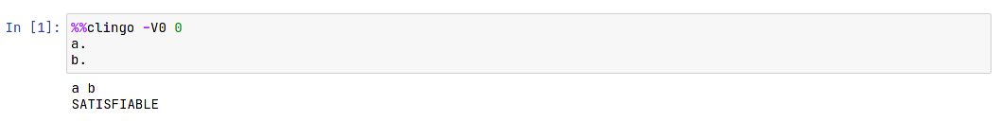

# clingo-notebook 📒

A docker image with [clingo](https://github.com/potassco/clingo), Jupyter, and
conda installed.

But why make this notebook if clingo has conda as a dependency anyway? 🤔

This is made for people who do not use conda primarily as their Python package
manager (such as myself) or for software developers who do not use Python
extensively but are probably serial docker users.

## Installation

[Install docker](https://docs.docker.com/get-docker/) if you have not already.

With docker installed:

```
docker pull stephsamson/clingo
```

## Quickstart

In your project workspace (such as `~/code/asp`, for example), run:

``` 
docker run --rm -p 8888:8888 -v "$PWD":/home/jovyan/work clingo
```

A Jupyter notebook link will appear on your terminal; copy and paste this link
onto your browser. Your project workspace will be under `/work` in the Jupyter
notebook tree.

Before you run a cell in a Jupyter notebook, make sure that you have the
following to run cell magic:

``` 
%%clingo -V0 0
```

... so it should look like this:



And that's it! 💫 

### No Notebook

If you don't need a notebook because you simply want to run the `.lp` file from
your project workspace:

```
# assumes dir has .lp files
docker run --rm -it -v "$PWD":/home/jovyan/work --entrypoint=/bin/bash clingo
```

This will run an interactive bash shell and your work will be under the `work`
directory.

## More Options

This docker image is built on
[jupyter/docker-stacks](https://github.com/jupyter/docker-stacks/) so it is capable
of accepting other options as written on their [documentation](https://jupyter-docker-stacks.readthedocs.io/en/latest/using/common.html).
